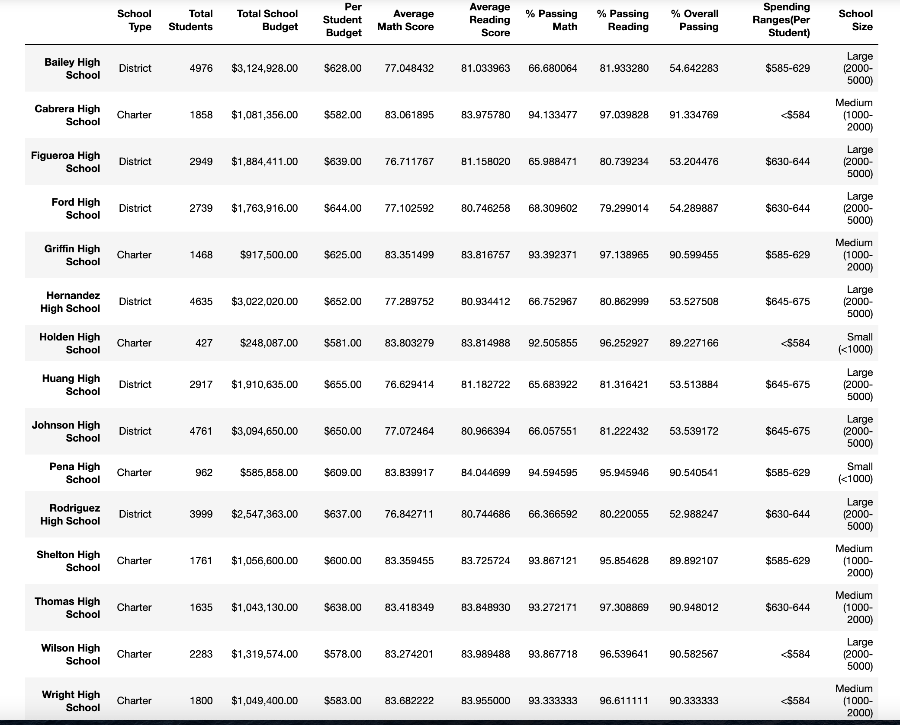
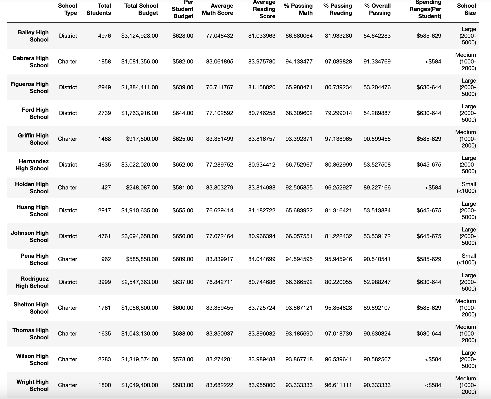
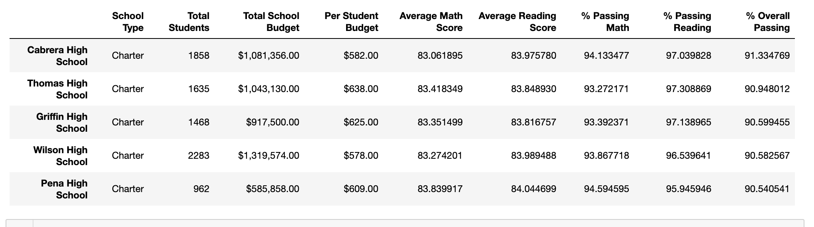
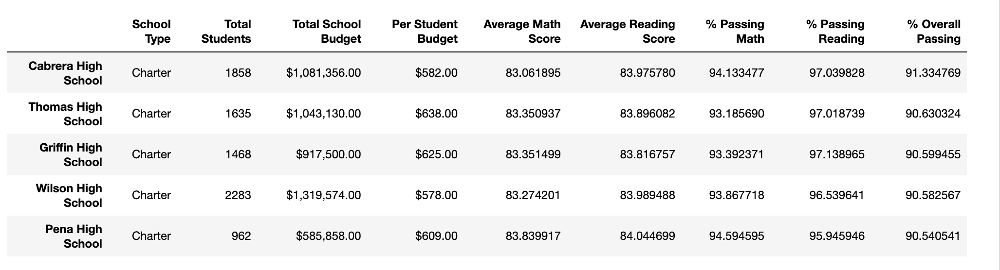

# School_District_Analysis
Analysis of State Testing data for the PyCity School District. 

## Overview of the school district analysis
In this analysis, we looked at the state testing outcomes for the PyCity School District. We calculated the average math and reading scores for each school site, as well as the passing rates for each section of the test, and the overall passing rate. We determined the top 5 and bottom 5 performing schools in the district. We further broke down the data into categories in order to compare performance between schools based on a number of variables including the amount spent per student, school size, and type of school (charter or district). After the initial analysis, there became some question of the reliability of the data from the Thomas High School 9th grade class. In order to correct for these possible issues, we stripped the 9th grade scores from Thomas High School and re-ran the analysis with the corrected data. 

## Results: 
Taking out the 9th grade Thomas High School math and reading test scores changed the data for the analysis. Luckily the deletion of the compromised data did not change the outcomes of our original analysis in any significant way. In our analysis, the DataFrames that summarized our findings were rounded to the nearest whole number. When the compromised data was taken out of our data set, the values in our analyses were changed only hundredths of a point, which did not shift in any direction enough to change our whole number values in the summary. After the values were rounded to the nearest whole number, the district summary and the Thomas High School summary both contained the same values are the original summaries performed on the compromised data. 

Replacing the 9th grade math and reading scores at Thomas High School with NaN values did not change the ranking of the schools relative to one another. Thomas High School remained the 2nd top performing school behind Cabrera High School and above Griffin High School. 

Additionally, replacing the ninth-grade scores did not affect any of the following relative to the original analysis: 
  - Math and reading scores by grade
  - Scores by school spending
  - Scores by school size
  - Scores by school type
 
Images of the original and modified DataFrames can be viewed in the Resources folder of this analysis for further inspection. 

## Summary: 
Summarize four changes in the updated school district analysis after reading and math scores for the ninth grade at Thomas High School have been replaced with NaNs.

